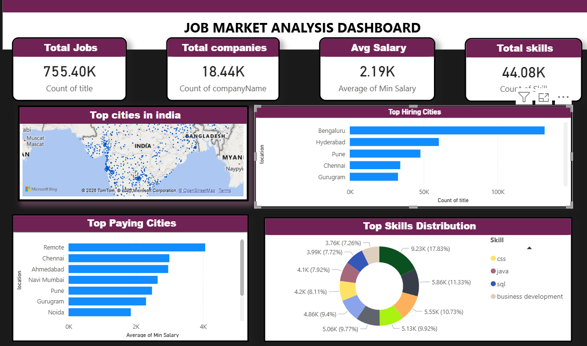

# 📊 Job Market Analysis Dashboard

## 📌 Overview

This Power BI dashboard provides insights into the job market, focusing on hiring trends, salary distribution, and in-demand skills across cities in India.

---

## 📷 Dashboard Preview

---

## 🚀 Key Features

* 📈 Total Jobs, Companies, Avg Salary & Skills KPIs
* 🗺️ Job distribution across India (Map Visualization)
* 🏙️ Top Hiring Cities
* 💰 Top Paying Cities
* 🧠 Skills demand distribution

---

## 🛠️ Tools Used

* Power BI
* Data Cleaning using DAX
* Data Visualization

---

## 📊 Insights

* Bengaluru and Hyderabad are leading hiring hubs
* Remote jobs offer higher average salaries
* Skills like SQL, Java, and Python dominate the market

---

## 🔗 Future Improvements

* Add time-based trends (monthly/yearly hiring)
* Include experience-level filtering
* Improve location granularity (city-wise cleaning)

---
